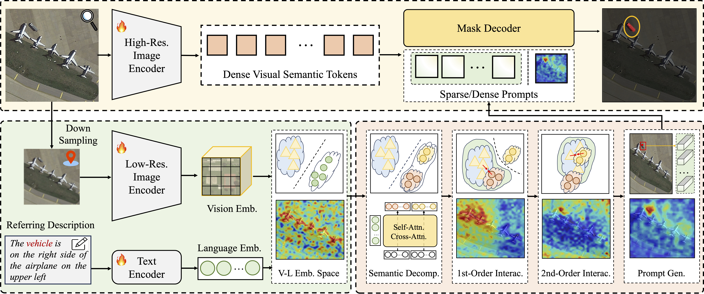

<div align="center">
    <h2>
        RSRefSeg 2: Decoupling Referring Remote Sensing Image Segmentation with Foundation Models
    </h2>
</div>
<br>

<div align="center">
  
</div>
<br>
<div align="center">
  <a href="https://github.com/KyanChen/RSRefSeg2">
    <span style="font-size: 20px;">Project Page</span>
  </a>
  &nbsp;&nbsp;&nbsp;&nbsp;
  <a href="https://arxiv.org/abs/2507.06231">
    <span style="font-size: 20px;">arXiv</span>
  </a>
  &nbsp;&nbsp;&nbsp;&nbsp;
  <a href="resources/RSRefSeg2.pdf">
    <span style="font-size: 20px;">PDF</span>
  </a>
</div>
<br>
<br>

[](https://github.com/KyanChen/RSRefSeg2)
[](LICENSE)
[](https://arxiv.org/abs/2507.06231)

<br>
<br>

<div align="center">

English | [简体中文](README_zh-CN.md)

</div>


## Introduction

This repository is the official implementation of the paper [RSRefSeg 2: Decoupling Referring Remote Sensing Image Segmentation with Foundation Models](https://arxiv.org/abs/2507.06231), developed based on the [OpenMMLab](https://openmmlab.com/codebase) codebase.

The current branch has been tested on Linux systems, with PyTorch 2.x and CUDA 12.1, supporting Python 3.10+ and compatible with most CUDA versions.

If you find this project helpful, please give us a star ⭐️, your support is our greatest motivation.

<details open>
<summary>Main Features</summary>

- APIs and usage consistent with OpenMMLab
- Open-sourced models and weights for different datasets mentioned in the paper
- Support for model training and testing

</details>

## Updates

<details>

🌟 **2025.07.10** Released RSRefSeg2 project.

</details>


## Table of Contents

- [Introduction](#introduction)
- [Updates](#updates)
- [Table of Contents](#table-of-contents)
- [Installation](#installation)
- [Dataset Preparation](#dataset-preparation)
- [Model Training and Testing](#model-training-and-testing)
- [Model Weights Download](#model-weights-download)
- [FAQ](#faq)
- [Acknowledgements](#acknowledgements)
- [Citation](#citation)
- [License](#license)
- [Contact](#contact)


## Installation

### Dependencies

- Linux (Windows also supported)
- Python 3.10+ (3.11 recommended)
- PyTorch 2.0 or higher (2.4 recommended)
- CUDA 11.7 or higher (12.1 recommended)
- MMCV 2.0 or higher (2.2 recommended)

### Environment Setup

We recommend using Miniconda for environment management and installation. The following commands will create a virtual environment called `rsrefseg2` and install PyTorch and MMCV. The default CUDA version is **12.1**, please adjust according to your actual CUDA version.

**Note**: If you are already familiar with PyTorch and have it installed, you can skip to the next section. Otherwise, please follow these steps:

<details>

**Step 0**: Install [Miniconda](https://www.anaconda.com/docs/getting-started/miniconda/install).

**Step 1**: Create and activate a virtual environment named `rsrefseg2`.

```shell
conda create -n rsrefseg2 python=3.11 -y
conda activate rsrefseg2
```

**Step 2**: Install [PyTorch2.4.x](https://pytorch.org/get-started/previous-versions/).

```shell
pip install torch==2.4.1 torchvision==0.19.1 torchaudio==2.4.1 --index-url https://download.pytorch.org/whl/cu121
# or
conda install pytorch==2.4.1 torchvision==0.19.1 torchaudio==2.4.1 pytorch-cuda=12.1 -c pytorch -c nvidia
```

**Step 3**: Install [MMCV2.2.x](https://mmcv.readthedocs.io/en/latest/get_started/installation.html).

```shell
pip install -U openmim
mim install mmcv==2.2.0
# or
pip install mmcv==2.2.0 -f https://download.openmmlab.com/mmcv/dist/cu121/torch2.4/index.html
```

**Step 4**: Install other dependencies.

```shell
pip install deepspeed==0.17.2  # Windows does not support DeepSpeed training, use AMP mixed precision training instead
pip install transformers==4.53.1 datasets
pip install -U ipdb braceexpand mat4py pycocotools shapely ftfy scipy terminaltables wandb prettytable torchmetrics importlib_metadata einops peft
pip install hydra-core iopath
```

</details>


### Installing RSRefSeg2

Download or clone the RSRefSeg2 repository:

```shell
git clone git@github.com:KyanChen/RSRefSeg2.git
cd RSRefSeg2
```


## Dataset Preparation

### Dataset Download

- [RefSegRS](https://huggingface.co/datasets/JessicaYuan/RefSegRS/tree/main)
- [RRSIS-D](https://github.com/Lsan2401/RMSIN)
- [RISBench](https://github.com/hit-sirs/crobim)

### Dataset Organization

Extract the downloaded data and organize it according to the original folder structure.

**Note**: In the project folder `datainfo`, we provide the dataset split files after conversion. You can also use the [Python scripts](tools_RSRefSeg2/data_tools) to convert the datasets.

## Model Training and Testing

### Config Files and Parameter Explanation

We provide RSRefSeg2 model configuration files for different datasets mentioned in the paper, which you can find in the [config folder](configs_RSRefSeg2). The Config files are fully consistent with the OpenMMLab API interface. Here we provide an explanation of the main parameters. For more parameter meanings, please refer to the [OpenMMLab documentation](https://mmsegmentation.readthedocs.io/zh-cn/latest/user_guides/1_config.html).

<details>

**Parameter Explanation**:

- `work_dir`: Output path for model training, generally no need to modify.
- `data_root`: Dataset root directory, **modify to the absolute path of your dataset root directory**.
- `cache_dir`: Model cache directory, **modify to the absolute path of your desired cache directory**.
- `batch_size`: Batch size per GPU, **modify according to your GPU memory size**.
- `max_epochs`: Maximum training epochs, generally no need to modify.
- `val_interval`: Validation set interval epochs, generally no need to modify.
- `dst_size`: Size of CLIP model feature image, **modify according to your actual situation**.
- `vis_backends/WandbVisBackend`: Configuration for network visualization tools, **after uncommenting, you need to register an account on the `wandb` website to view the training process visualization results in a web browser**.
- `load_from`: Path to the model pretrained checkpoint, generally no need to modify.
- `resume`: Whether to resume training from a checkpoint, generally no need to modify.
- `default_hooks/CheckpointHook`: Checkpoint saving configuration during model training, generally no need to modify.
- `default_hooks/visualization`: Set `draw` to `True` for visualization on validation and test sets, `interval` sets the visualization interval epochs, generally no need to modify.
- `model/lora_cfg`: LoRA configuration for model vision backbone, generally no need to modify.
- `model/backbone`: Model vision backbone, generally no need to modify.
- `model/prompter`: Model prompter configuration, generally no need to modify.
- `model/decode_head`: Model decode head configuration, generally no need to modify.
- `AMP training config`: Configuration for mixed precision training, uncomment if not using DeepSpeed training, generally no need to modify.
- `DeepSpeed training config`: Configuration for DeepSpeed training, uncomment if using DeepSpeed training and comment out the AMP training config. Note that Windows systems do not support DeepSpeed training.
- `data_preprocessor/mean/std`: Mean and standard deviation for data preprocessing, generally no need to modify.

</details>

### Training

```shell
# Single GPU training
python tools_mmseg/train.py configs_RSRefSeg2/name_to_config.py  # name_to_config.py is the configuration file you want to use
# Multi-GPU training
sh tools_mmseg/dist_train.sh configs_RSRefSeg2/name_to_config.py ${GPU_NUM}  # name_to_config.py is the configuration file you want to use, GPU_NUM is the number of GPUs to use
```

### Testing

To visualize and save prediction result images during testing, set the `draw` parameter under `default_hooks/visualization` to `True` in the configuration file.

```shell
# Single GPU testing
python tools_mmseg/test.py configs_RSRefSeg2/name_to_config_infer.py ${CHECKPOINT_FILE}  # name_to_config_infer.py is the configuration file you want to use, CHECKPOINT_FILE is the path to the model checkpoint you want to evaluate

# Multi-GPU testing
sh tools_mmseg/dist_test.sh configs_RSRefSeg2/name_to_config_infer.py ${CHECKPOINT_FILE} ${GPU_NUM}  # name_to_config_infer.py is the configuration file you want to use, CHECKPOINT_FILE is the path to the model checkpoint you want to evaluate, GPU_NUM is the number of GPUs to use
```


## Model Weights Download

You can access and download the pre-trained model weights from the [Hugging Face](https://huggingface.co/KyanChen/RSRefSeg2) platform.

## FAQ

<details>

Here we list some common issues that you might encounter during usage and their solutions. If you find an issue that is not covered, you are welcome to submit a PR to enrich this list. If you cannot find the help you need here, please submit an issue through [GitHub Issues](https://github.com/KyanChen/RSRefSeg2/issues). Please make sure to fill in all necessary information, which will help us locate and resolve your problem more quickly.

### 1. Is it necessary to install MM series packages?

We strongly recommend not installing MM series packages (such as MMSeg) because this project already includes all the necessary components. Installing additional MM series packages may cause code execution conflicts. If you encounter a "module has not been registered" error, please check the following:

- Confirm whether the module is an external dependency that needs to be installed
- Check if MM series packages are installed, and uninstall them if they are
- Verify that the `@MODELS.register_module()` decorator has been added before relevant class names
- Check if the `__init__.py` file contains the import statement `from .xxx import xxx`
- Verify that the configuration file includes the `custom_imports = dict(imports=['refseg'], allow_failed_imports=False)` configuration item

### 2. Resolving dist_train.sh: Bad substitution error

If you encounter a `Bad substitution` error when executing the `dist_train.sh` script, try running the script with the command `bash dist_train.sh`.

### 3. Solutions for Hugging Face model download issues

If you have difficulties downloading models from Hugging Face, try setting the following environment variable in your command line:

```shell
export HF_ENDPOINT=https://hf-mirror.com
```
</details>


## Acknowledgements

This project is developed based on the [OpenMMLab](https://openmmlab.com/codebase) ecosystem. We sincerely thank all contributors from the OpenMMLab community.

## Citation


If you use our code or benchmarks in your research or project, please cite our work using the following BibTeX:


```
@misc{chen2025rsrefseg2decouplingreferring,
      title={RSRefSeg 2: Decoupling Referring Remote Sensing Image Segmentation with Foundation Models}, 
      author={Keyan Chen and Chenyang Liu and Bowen Chen and Jiafan Zhang and Zhengxia Zou and Zhenwei Shi},
      year={2025},
      eprint={2507.06231},
      archivePrefix={arXiv},
      primaryClass={cs.CV},
      url={https://arxiv.org/abs/2507.06231}, 
}
```


## License
This project is licensed under the [Apache 2.0 License](LICENSE).

## Contact
If you have any questions or suggestions ❓, please feel free to contact our team 👬

